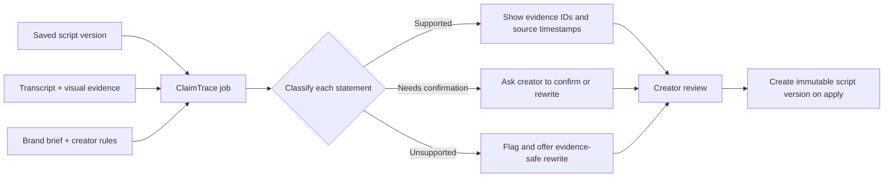

# ClaimTrace — Evidence-backed content review

## What it is

**ClaimTrace** is a creator-facing review layer that explains whether each
script section, caption, or promotional statement is supported by the material
already present in CreatorAI.

It gives every reviewed item one of three visible states:

| State | Meaning | Creator action |
| --- | --- | --- |
| **Supported** | The statement is grounded in selected transcript or visual evidence. | Inspect the linked timestamp if desired. |
| **Needs confirmation** | It is a brand claim, opinion, CTA, or promise which footage cannot independently establish. | Confirm it, add a supplied source, or rewrite it. |
| **Unsupported** | No relevant evidence was found, or it conflicts with a deterministic brand rule. | Remove it or apply an evidence-safe rewrite. |

ClaimTrace does not assert that something is objectively true. It reports only
whether the claim is supported by the creator's own footage, saved brand brief,
or explicit creator confirmation. That boundary keeps the feature useful and
honest for a hackathon demo.

## Why build this next

Most AI content tools can generate a script or cut a video. ClaimTrace makes
CreatorAI visibly more trustworthy: it shows *why* an AI-generated sentence is
safe to use and lets the creator correct it before publishing.

It is fast to build because CreatorAI already persists the required inputs:

- immutable script sections and saved versions;
- timestamped transcript segments and visual observations;
- script-to-footage alignments and evidence IDs;
- creator style and campaign/brand requirements;
- assistant proposals, direct edits, and immutable version history.

The feature is therefore primarily a new structured review result and a clear
interface, not a new media pipeline or third-party integration.

## Demo moment

1. Generate a script containing: “This product saves you 40% of your time.”
2. Open **ClaimTrace** beside the script.
3. The sentence appears as **Unsupported** because no uploaded evidence or
   approved brand claim supports the number.
4. Select **Rewrite safely**. The assistant proposes: “This workflow is
   designed to help you create content faster.”
5. Apply the proposal. CreatorAI creates a new script version and records that
   the replacement is a creator-reviewed marketing statement.
6. Click a green line to jump the source player to its supporting transcript
   and frame timestamp.

This makes the innovation understandable in under a minute.

## Creator flow



## Scope for the second-round build

### Must have

- A **ClaimTrace** button on the Script screen for a saved script version.
- A review panel showing statement text, state, short explanation, severity,
  and evidence timestamps when available.
- A source-player jump for supporting video evidence.
- An AI rewrite proposal for an unsupported statement; applying it must reuse
  the current immutable-script-version flow.
- A visible disclaimer: **“Evidence support is not independent fact checking;
  creator review is required.”**

### Nice to have

- Filter chips: All, Supported, Needs confirmation, Unsupported.
- A project-level score such as `8 / 10 statements evidence-backed`. Do not
  call it a factual-accuracy score.
- Include the completed review summary in the existing package-approval
  snapshot.

### Explicitly out of scope

- Browsing the web or claiming external fact verification.
- Automatic publishing blocks or legal/compliance decisions.
- Automatic modification of a saved script.
- New vector databases, external search providers, or a separate queue system.

## Review contract

Use IDs from persisted evidence; the model must never invent a timestamp or an
evidence reference. A proposed response shape is:

```json
{
  "script_version_id": "script_version_123",
  "items": [
    {
      "section_id": "section_2",
      "statement": "This product saves you 40% of your time.",
      "kind": "quantified_marketing_claim",
      "state": "unsupported",
      "severity": "high",
      "reason": "No saved evidence or approved brand requirement supports the percentage.",
      "evidence_ids": [],
      "suggested_rewrite": "This workflow is designed to help you create content faster."
    },
    {
      "section_id": "section_3",
      "statement": "The setup takes only a few minutes.",
      "kind": "demonstration_claim",
      "state": "supported",
      "severity": "info",
      "reason": "The setup sequence is visible in the selected source video.",
      "evidence_ids": ["transcript_segment_14", "visual_observation_7"],
      "suggested_rewrite": null
    }
  ],
  "summary": {
    "supported": 1,
    "needs_confirmation": 0,
    "unsupported": 1
  }
}
```

Suggested constrained enums:

```text
state: supported | needs_confirmation | unsupported
severity: info | medium | high
kind: demonstrated_fact | quantified_marketing_claim | product_claim |
      opinion | CTA | instruction | other
```

The backend validates that every returned `section_id` belongs to the requested
version and every `evidence_id` belongs to the project's selected source asset.
Invalid model output is rejected instead of being shown as evidence.

## Implementation shape

### Backend

Keep the implementation in a small feature folder, for example:

```text
backend/app/features/claimtrace/
  schemas.py       # Pydantic request and response models
  service.py       # evidence packing, model call, deterministic validation
  router.py        # owner-scoped API endpoints
  prompts.py       # structured review and rewrite instructions
  tests/           # service and API validation tests
```

Recommended endpoints:

| Endpoint | Purpose |
| --- | --- |
| `POST /v1/projects/{project_id}/scripts/{version_id}/claimtrace` | Run or enqueue review for one immutable version. |
| `GET /v1/projects/{project_id}/scripts/{version_id}/claimtrace` | Return the most recent completed review for that version. |
| `POST /v1/projects/{project_id}/scripts/{version_id}/claimtrace/rewrite` | Request one scoped rewrite proposal; reuse the existing apply/discard flow. |

For the quickest credible MVP, return a `202` job response and reuse the
existing durable job infrastructure. If the UI needs a faster demo fallback,
the review may run synchronously only for small saved scripts; it must still be
owner-scoped and never overwrite content.

### Model prompt rules

Pass only the selected script sections, approved brand requirements, relevant
transcript segments, and bounded visual observations. Instruct the model to:

1. classify every claim;
2. select zero or more *existing* evidence IDs;
3. mark marketing claims needing explicit creator confirmation when evidence
   cannot establish them;
4. give a concise reason;
5. supply a conservative rewrite only for unsupported items;
6. return strict JSON matching the Pydantic schema.

Perform deterministic checks after the model response:

- forbidden phrases and literal required phrases use the existing requirement
  validator;
- IDs must be valid and owned by the project;
- claimed source timestamps come from persisted evidence, never the model;
- no item may be reported as independent fact verification.

### Frontend

Add a collapsible **ClaimTrace** drawer on the Script screen. Each script
section receives a small status chip. Selecting an item opens a detail card
with the reason, linked evidence, and a `Rewrite safely` action.

Use the existing source-player seek behavior from evidence inspection. Use the
existing assistant proposal UI and `Apply`/`Discard` actions for rewrites so a
new script version is created rather than mutating the current one.

## Build order — 2 to 3 hours

1. **45 minutes — backend contract:** create schemas, pack project-owned
   evidence, make the structured model call, and validate evidence IDs.
2. **35 minutes — review UI:** add the ClaimTrace trigger, summary pills, and
   per-section result cards using mocked or fixture data first.
3. **25 minutes — evidence links:** connect supported results to the existing
   transcript/frame player seek action.
4. **25 minutes — rewrite:** route one unsupported item through the current
   assistant proposal/apply path.
5. **20 minutes — guardrails and polish:** owner checks, loading/error states,
   empty-evidence message, disclaimer, and one convincing prepared demo.

If time runs short, ship steps 1, 2, and 5. A reliable evidence-status panel is
more impressive than a partially working automatic rewrite.

## Acceptance criteria

- ClaimTrace only accesses the authenticated creator's project, script,
  selected asset, and evidence.
- A result clearly distinguishes supported evidence from creator confirmation.
- Supported items link to a persisted timestamped transcript segment or visual
  observation.
- The model cannot invent evidence IDs or source timestamps.
- A rewrite remains a proposal until the creator explicitly applies it.
- Applying a rewrite creates a fresh immutable script version and makes old
  results visibly belong to the old version.
- No item is presented as legal advice, copyright clearance, or external fact
  verification.

## Presentation line

> “CreatorAI does not just generate a script. ClaimTrace shows what in that
> script is grounded in the creator’s actual footage, what needs confirmation,
> and what should be corrected before it reaches an audience.”
