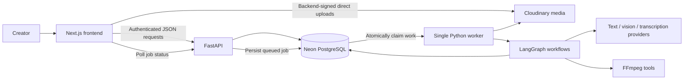

# CreatorAI implementation plan

## Confirmed constraints

- Working time: **12 hours**; submission/demo deadline: **4 October 2026, 11:00 AM IST**.
- Frontend deployment: **Vercel**.
- Backend deployment: **Hugging Face Docker Space**, running FastAPI + LangGraph + FFmpeg.
- Media storage and delivery: **Cloudinary** for images, videos, audio, previews, and exports.
- Hosted SQL: **Neon PostgreSQL** for application records, jobs, and LangGraph checkpoints.
- Target: a small working implementation of every listed feature, connected into one demo.

Prioritize the functional media path and integration; polish after the eight acceptance checks pass.

## Exact hackathon scope

Use one creator account, one project, one 2–5 minute source video, three clip proposals, and an editor with trim/caption/crop controls. Export vertical and square variants. Include project stages, a planned publishing date, manual publication status, and insights using production events plus manually entered performance.

Support uploading videos, images, and audio in the asset library. Demonstrate at least one script-to-footage match using sampled visual evidence. Preserve the original source and save versioned edit recipes.

The hosting choice is confirmed. Social-account publishing is still unspecified; this plan assumes downloadable packages and manual publication tracking. This does not implement automatic posting. Browser recording, social OAuth, automatic scheduling, complex timeline tracks, collaborative editing, automatic face tracking, and open-ended AI editor chat are outside this 12-hour baseline.

## Hosting plan for Vercel + Hugging Face

1. Create a Docker Space, set `sdk: docker` and `app_port: 7860`, and run FastAPI on `0.0.0.0:7860`. Install FFmpeg with subtitle support and suitable fonts in the image. Hugging Face documents FastAPI support and the exposed port in its [Docker Spaces guide](https://huggingface.co/docs/hub/spaces-sdks-docker).
2. Set Vercel's `NEXT_PUBLIC_API_BASE_URL` to the Space's actual app URL, obtained from its UI. The browser sends the creator's auth token to FastAPI. Allow the actual Vercel production origin and localhost in FastAPI CORS; add only intended preview origins. See [FastAPI CORS](https://fastapi.tiangolo.com/tutorial/cors/).
3. Store original media, previews, and exports in Cloudinary with restricted delivery. Store projects, jobs, recipes, performance records, and LangGraph checkpoints in Neon PostgreSQL. HF local disk is temporary: it can be lost on restart/stop. Use it only for downloaded inputs and render scratch files. See [HF disk usage](https://huggingface.co/docs/hub/spaces-storage).
4. Put model credentials, Neon connection strings, and `CLOUDINARY_API_SECRET` in HF runtime secrets. Use `CLOUDINARY_CLOUD_NAME` and `CLOUDINARY_API_KEY` to configure the backend SDK. Browser upload requests receive only the public upload configuration and backend-generated signatures; the API secret and database credentials stay on the backend.
5. Run one API process and one lightweight Python worker process in the same Docker Space, with process supervision and graceful shutdown. The worker reads persisted jobs from Neon PostgreSQL and executes one media job at a time. No separate Redis/Celery deployment is needed for this demo.
6. A queued job returns `202` immediately; frontend polls `/jobs/{id}` every few seconds. Claim work atomically; use job IDs for idempotency. On restart, mark abandoned running jobs retryable and resume from persisted checkpoints when appropriate. A graph waiting for creator review releases the worker.
7. Use hosted text/vision/transcription calls. HF hosts your API and render tools; it does not require you to run the AI models locally. Budget frame sampling and render concurrency to the chosen Space hardware.
8. Check Docker Space access before implementation. Current [HF overview documentation](https://huggingface.co/docs/hub/spaces-overview) says creating compute-backed Docker Spaces requires a paid plan. Confirm your account has the necessary access before depending on this deployment path; plan completion does not authorize purchasing a plan.

### Cloudinary media flow

FastAPI authorizes uploads and signs controlled parameters. The browser uploads directly to Cloudinary, then submits completion metadata for backend verification before ingestion. Use `resource_type: image` for images and `resource_type: video` for videos and audio; use chunked uploads for larger footage. See [Cloudinary uploads](https://cloudinary.com/documentation/upload_images) and [client-side uploads](https://cloudinary.com/documentation/client_side_uploading).

Store `asset_id`, `public_id`, `resource_type`, delivery `type`, `version`, format, byte size, and available media dimensions/duration in Neon. IDs and versions identify source media; a URL alone is not the asset identity or an access-control mechanism.

Use authenticated delivery for creator assets so originals and derived resources require authorization. After checking project ownership, FastAPI can issue time-limited original download links with the SDK's `private_download_url`; signed transformation URLs are not automatically expiring. See [Cloudinary upload and access parameters](https://cloudinary.com/documentation/upload_parameters).

The worker downloads authorized source media, processes it with FFmpeg, and uploads completed previews/exports to Cloudinary. Mark an export complete only after that upload succeeds and its metadata is saved in Neon. Cloudinary provides storage and delivery; the versioned recipe and FFmpeg remain the authority for final edits.

### Neon database connections

Use SQLAlchemy/Alembic for application data and the PostgreSQL LangGraph checkpointer for execution state, both backed by Neon. Keep media bytes in Cloudinary and store media references in SQL.

Use a Neon direct PostgreSQL connection for the long-running backend/checkpointer with small connection pools, and for migrations. Preserve the connection string's TLS settings. Neon also supports pooled connections when application concurrency needs them; validate driver/checkpointer compatibility before changing connection mode. See [Neon's connection guide](https://github.com/neondatabase/website/blob/main/content/docs/get-started/connect-neon.md).

Authentication is independent of Cloudinary and the hosted SQL database. Preserve the authenticated creator session and FastAPI ownership checks; the auth/session provider remains a separate implementation choice.

## Repository directory layout

The repository is organized into a deployable frontend, a deployable backend, and shared API contracts. Keep frontend-only code under `frontend/`, backend-only code under `backend/`, and any interface consumed by both sides under `contracts/`.

```text
creatorai/
  compose.yaml               # local multi-service development entry point
  README.md                  # repository setup and demo instructions
  docs/
    creatorai-build-plan.md  # this implementation plan
  frontend/                  # Next.js application deployed to Vercel
    app/                     # routes: projects, script, assets, clips, publish, insights
    components/              # workspace shell, UI, uploads, editor, and insights views
    lib/                     # FastAPI client and creator-session helpers
    public/                  # static browser assets, when needed
    package.json             # frontend scripts and dependencies
    next.config.js           # Next.js configuration
  backend/
    app/
      main.py                # FastAPI app, CORS, router registration, and health endpoint
      config.py              # environment-backed application settings
      models.py              # SQLAlchemy domain model
      schemas.py             # request/response and edit-recipe contracts
      worker.py              # persisted job loop; one concurrent render
      routes/                # project, asset, script, clip, job, publication, and insight APIs
      graphs/                # LangGraph script and repurposing workflows
      services/              # Cloudinary, transcription, vision, rendering, and metrics adapters
    alembic/                 # database migration environment and revisions
    tests/                   # backend API and service tests
    scripts/                 # maintenance utilities, including OpenAPI export
    docker/start.sh          # API/worker container startup command
    Dockerfile               # Hugging Face Docker Space image
    pyproject.toml           # Python dependencies and tooling configuration
    alembic.ini              # Alembic configuration
    README.md                # backend and Hugging Face Space instructions
  contracts/                 # shared, generated API contract artifacts
    openapi.json             # FastAPI OpenAPI snapshot used by the frontend
    fixtures/                # representative project, job, and edit-recipe payloads
    README.md                # contract generation and consumption notes
```

Generated outputs, local media scratch files, dependency directories, credentials, and environment files are intentionally excluded from this layout. The backend uses temporary local storage only while rendering; durable media remains in Cloudinary and durable records remain in Neon PostgreSQL.

## Goal

Build a working creator workspace with Next.js for the frontend and FastAPI + LangGraph for the AI backend. Demonstrate all eight features through one connected workflow:

**Idea → script and hooks → uploaded footage → script/footage alignment → suggested clips → editable cuts → platform exports → publishing workflow → creator insights.**

The attached problem statement supplies the product requirements. The architecture, limits, and acceptance criteria below are proposed implementation choices.

## Proposed scope and assumptions

- Start with one pre-created creator account owning projects; include authentication and ownership checks. Signup/onboarding is outside this demo.
- Use real uploaded media, real model calls, and real rendered MP4s for the main demo.
- Start with a single primary source video per editing sequence. The asset library supports videos, images, and audio from the beginning.
- Use a proposed input limit of 5 minutes and 100 MB per video, configurable after measuring the deployed Space. Use a short 2–5 minute source in the demo. This is a product limit, not a promise about processing speed.
- Keep the creator's original media immutable. Every AI edit produces a versioned edit recipe that the creator can change.
- Begin with downloadable platform packages, a planned publishing date, and manual publication tracking. This covers a manual publishing workflow, not automated social publishing. Revisit direct publishing if the judging rubric requires it.
- Performance data initially comes from manual entry of real results. Any seeded demo data must be visibly marked as sample data. CSV import is outside this time budget.
- The dependency-ordered phases below provide implementation contracts and acceptance checks.
- Browser recording is an optional extension: the narrative mentions recording, but it is not one of the eight enumerated features. Uploads cover the initial ingestion path; confirm the judging rubric before excluding in-app recording.

## Feature coverage and acceptance criteria

| Required feature | Frontend experience | Backend implementation | Done when |
|---|---|---|---|
| Asset management | Upload, thumbnails/previews, tags, type filter, project assignment | Cloudinary media storage with restricted delivery; metadata and ownership in Neon PostgreSQL; metadata probing and preview generation | A creator can upload and retrieve video, image, and audio assets without another creator accessing them |
| AI script and hook generation | Brief form; several hooks; editable script sections; supporting copy; version history | Structured model generation from topic, audience, tone, duration, and platform; validated response schemas | A brief generates hooks, an editable script, title, description, CTA, and useful production notes |
| Script-to-video understanding | Script section beside matched transcript range and timestamped visual evidence; click to seek; unmatched/low-confidence states | Timestamped transcription; scene/frame observations from a vision-capable model; semantic script-to-footage alignment | Script sections point to actual source ranges, including one demonstrable match using visual information |
| Automated clip generation | Suggested clip cards with preview, duration, source ranges, evidence, and selection controls | Candidate selection from aligned sections/transcript; hook and coherence ranking; deterministic timestamp validation; rendered preview | The system proposes several grounded clips and renders at least one usable short-form video |
| AI-assisted editable editing | Trim inputs/handles, caption corrections, crop positioning, save and revert | AI-generated editable recipe; versioned edit decision list; server validation; FFmpeg rendering | A creator changes an AI cut or caption, saves it, reloads it, and exports the revised result |
| Multi-platform adaptation | Platform tabs; aspect-ratio preview; editable title/caption/hashtags and export settings | Configurable presets for dimensions, padding/crop, caption margins, and supporting copy | One clip produces actual vertical and square/landscape exports; platform variants have independently editable metadata |
| Content workflow | Project stage, checklist, review state, planned date, publishing status/link | Explicit allowed state transitions; publication records; job tracking | A project progresses from idea through assets, editing, approval, exported package, and confirmed manual publication |
| Creator intelligence | Production stats and performance comparisons; recommendations with evidence | Deterministic aggregations over workflow timestamps, clips, and sourced performance snapshots; model summarizes computed facts | The dashboard shows production patterns and content-performance comparisons, handles missing data, and explains recommendations |

## Architecture



### Recommended stack

| Layer | Choice | Responsibility |
|---|---|---|
| Frontend | Next.js App Router + TypeScript | Navigation, project screens, interactive editor |
| Styling/components | Tailwind CSS + shadcn/ui | Consistent forms, dialogs, tabs, cards, and status feedback |
| Frontend API state | TanStack Query | API cache, mutations, job polling, invalidation |
| Editor local state | React state/reducer | Unsaved edit recipe, selected segment, reset to saved version |
| API | FastAPI + Pydantic | Auth, validation, project operations, jobs, exports |
| Database layer | Neon PostgreSQL + SQLAlchemy + Alembic | Durable application data and migrations |
| Media storage/delivery | Cloudinary + Python SDK | Signed uploads, restricted source media, previews, and rendered exports |
| Authentication | Creator session/JWT verified by FastAPI; provider to be selected | Identity and project ownership, independent of media/database providers |
| Work execution | Neon PostgreSQL jobs table + one Python worker process | Durable queue, explicit retries, one concurrent media job |
| AI orchestration | LangGraph with a PostgreSQL checkpointer on Neon | Grounded analysis, conditional repair, review pauses, resume |
| Media tools | FFmpeg + ffprobe | Probe, extract audio/frames, create proxies, trim, crop, captions, final renders |
| AI providers | One text/vision provider plus timestamp-capable speech-to-text | Choose the exact models after testing quality, availability, latency, and budget |

Use Server Components for the shell and initial page data; Client Components for uploads, playback, editor controls, and polling. This follows the browser-interactivity boundary described in the [Next.js documentation](https://nextjs.org/docs/app/getting-started/server-and-client-components).

FastAPI owns application data and business rules. Next.js handles the interface and creator session; browser API calls go directly to the authenticated FastAPI endpoints.

Video processing runs in a separate worker process, using the existing PostgreSQL jobs table to keep the demo infrastructure small. FastAPI's [background task documentation](https://fastapi.tiangolo.com/tutorial/background-tasks/) discusses moving heavy computation outside the request process; this plan uses a single worker rather than adding a distributed queue service.

Deploy Next.js to Vercel and the FastAPI/worker container to Hugging Face as specified above. Use external database/storage for durability. A local Docker run uses the same backend image and external services.

## Frontend plan

Use a persistent project sidebar: **Overview, Script, Assets, Clips, Publish, Insights**. Give each generated result an obvious edit action, source evidence, processing status, and recovery action.

| Route | Main components and interactions |
|---|---|
| `/projects` | Project cards, new project, project stage, recent activity |
| `/projects/[id]` | Brief summary, workflow checklist, next action, current jobs |
| `/projects/[id]/script` | Audience/tone/duration form; hook alternatives; section-based script editor; title/description/CTA; save |
| `/projects/[id]/assets` | Upload queue, upload progress, tags/search/type filter, playable previews, transcript, script-to-footage alignment panel |
| `/projects/[id]/clips` | Suggested clips, source evidence, preview, selection, generation status |
| `/projects/[id]/clips/[clipId]` | Video preview, source trim, captions, crop, save/revert, platform presets, render/export |
| `/projects/[id]/publish` | Export package, planned date, per-platform metadata, manual publication confirmation and URL; connected publishing if enabled |
| `/projects/[id]/insights` | Production metrics, manually entered performance, basic comparisons, evidence-backed recommendations |

### Editor layout

- Left: source transcript and script-section matches; clicking an entry seeks the source player.
- Center: source/draft preview, aspect-ratio frame, caption/text overlay.
- Bottom: clip source start/end inputs; add handles only after the numeric controls work.
- Right: editable caption text, crop position, platform metadata, save/revert and export.

Initial editing scope: trim, correct captions, reposition crop, revert to the last saved version. Save explicitly and show saving/saved/conflict states. Prefer one contiguous source range per proposed clip in this demo; the recipe can support multiple segments without requiring a multitrack UI.

Use a native video element to preview individual source segments interactively. Generate a low-resolution draft render for the authoritative preview of joined cuts and final styling. The final renderer must consume the same edit recipe. Do not treat browser overlays alone as proof of export correctness.

## Backend domain model

| Entity | Essential fields |
|---|---|
| `Project` | ID, owner ID, brief, audience, tone, target platforms, workflow stage, timestamps |
| `ScriptVersion` | Project ID, version, hooks, ordered sections with stable IDs, supporting copy, origin |
| `Asset` | Project/owner IDs, kind, Cloudinary asset/public IDs, resource/delivery type, version, format, byte size, duration/dimensions, tags, processing status |
| `TranscriptSegment` | Asset ID, source start/end milliseconds, text, optional word timings |
| `VisualObservation` | Asset ID, source timestamp/range, sampled frame IDs, description, observation confidence |
| `ScriptAlignment` | Script version/section, source asset/ranges, transcript/frame evidence, match status, confidence |
| `Clip` | Project ID, title, proposal reason, evidence references, current edit version |
| `EditVersion` | Clip ID, parent version, immutable JSON recipe, author type, schema version |
| `Export` | Edit version, preset/version, metadata snapshot, status, Cloudinary asset/public IDs and delivery metadata, render job ID |
| `Job` | Project ID, type, status, stage, attempt, graph thread ID, input versions, timestamps, error |
| `Publication` | Export ID, platform, planned date, actual published date, manual/API mode, status, external URL |
| `PerformanceSnapshot` | Publication ID, observation date, views/likes/comments/shares and optional retention, source, reporting window |

Scope every read and write to the authenticated owner/project. FastAPI verifies the creator's session/token before accepting resource IDs; browser-provided ownership is never authoritative. Cloudinary upload completion metadata must also be verified against the authorized upload parameters and provider response.

Store media in Cloudinary with restricted delivery and structured records in Neon PostgreSQL. Put IDs and artifact references in LangGraph state rather than raw video bytes. Graph checkpoints support execution recovery; application tables remain the source of truth for scripts, edits, exports, and publication state.

### Editable media contract

Use an **edit decision list**, an instruction document describing how to assemble the original media. For example:

```json
{
  "schema_version": 1,
  "source_asset_id": "asset_123",
  "segments": [
    {"id": "cut_1", "source_start_ms": 42000, "source_end_ms": 57000},
    {"id": "cut_2", "source_start_ms": 71000, "source_end_ms": 86000}
  ],
  "output": {"width": 1080, "height": 1920, "fit": "crop"},
  "crop": {"center_x": 0.55, "center_y": 0.50},
  "captions": [
    {"start_ms": 0, "end_ms": 2200, "text": "Your editable opening caption"}
  ],
  "overlays": [
    {"start_ms": 0, "end_ms": 3000, "text": "3 mistakes to avoid", "position": "top"}
  ]
}
```

Segment times use the source video's clock. Caption and overlay times use the assembled output clock. Build and test the mapping between these clocks; rebuild/remap caption timings when cuts change. Crop coordinates are normalized to the source frame and clamped against the requested aspect ratio.

AI returns validated proposed recipes. A creator saving changes creates a new version; it never overwrites the source or silently changes an already approved export. Every render references an immutable edit version. Reject stale edits with an optimistic version check. Generic natural-language AI edit commands are outside this baseline.

FFmpeg performs both video and audio trimming, timestamp reset, concatenation, crop/scale/pad, and subtitle rendering. Its [filter documentation](https://ffmpeg.org/ffmpeg-filters.html) covers these operations; ensure the worker build includes libass and the required fonts for captions.

## LangGraph workflow plan

Implement two focused workflows, using shared tool functions. Nodes are processing steps; only steps that need reasoning invoke a model.

### Workflow A: brief to script

`validate brief → generate hooks → draft structured script/supporting copy → validate output → save script version`

An invalid model response gets one bounded repair attempt, then returns a clear error. The creator edits the saved version in the Script screen. Regeneration creates another version.

### Workflow B: footage to editable exports

```text
Validate source and script versions
    ↓
Probe media; create proxy/audio; transcribe; sample scenes/frames
    ↓
Understand visual observations and align script sections with footage
    ↓
Identify and rank candidate ranges with transcript/frame evidence
    ↓
Validate source ranges, duration, sentence boundaries, and duplicate clips
    ├─ weak evidence → inspect additional relevant frames once → validate again
    ├─ no useful candidates → ask creator to select a source range
    └─ valid candidates → build editable recipes and draft previews
                                   ↓
                        Creator review / edit pause
                                   ↓
                 Load and validate selected edit version
                                   ↓
                     Adapt selected platform presets
                                   ↓
                         Render and verify exports
```

1. Extract time-aligned transcript segments. Request word timings when supported; segment timings are sufficient for the first caption implementation.
2. Sample frames at scene changes and a bounded interval. Ask a vision-capable model for timestamped observations, including visible products, slides, demonstrations, and changes in subject. Initial sampling is sparse; inspect additional frames around uncertain matches.
3. Align each script section to transcript and visual evidence. Allow unmatched and partial matches. Do not force a match if the creator departed from the script.
4. Return candidates as grounded segment IDs/ranges, selection rationale, and supporting evidence. A ranking is a heuristic for review, not a predicted viral-performance metric.
5. Deterministically validate `0 <= start < end <= duration`, intended output duration, duplicate proposals, and playable boundaries. Snap to measured transcript/scene boundaries where appropriate.
6. Save recipes and preview artifacts, then pause for review using a LangGraph interrupt. The worker exits its task when the graph pauses; a human review must not occupy a worker slot.
7. The review API validates ownership, paused run, and selected edit version, then queues a resume task with the same graph thread ID. Reject duplicate/stale resume requests.
8. Render exports from the selected immutable edit version. Verify output duration, dimensions, audio presence where expected, and playability before marking complete.

LangGraph supports this persistence and review/resume pattern through [checkpointers](https://docs.langchain.com/oss/python/langgraph/persistence) and [interrupts](https://docs.langchain.com/oss/python/langgraph/interrupts). A resumed interrupted node restarts from its beginning; keep writes/tool side effects out of the pre-interrupt portion or make them idempotent.

### Shared graph state

Keep `project_id`, `job_id`, `thread_id`, source/script versions, artifact references, alignment references, candidate IDs, selected edit version, preset versions, review status, errors, and retry count. Persist large transcripts/observations separately and load only needed portions.

One graph run should represent one user operation, not the entire lifetime of a project. An interrupted workflow is resumed using its existing run/thread identity; a new generation operation gets a new run.

## API contracts

Use `/v1` and typed schemas. Generate frontend API types from FastAPI's OpenAPI schema. Long-running operations return HTTP `202` plus a `job_id`; polling reports honest stage information rather than invented percentages.

| Method and endpoint | Responsibility |
|---|---|
| `POST /v1/projects`, `GET /v1/projects` | Create/list owned projects |
| `GET/PATCH /v1/projects/{id}` | Read/update brief and project details |
| `POST /v1/projects/{id}/assets/upload-session` | Authorize Cloudinary upload; return controlled parameters, timestamp, and backend-generated signature |
| `POST /v1/assets/{id}/complete` | Verify Cloudinary upload, save media identifiers/metadata in Neon, and enqueue ingestion |
| `GET /v1/projects/{id}/assets` | Asset list and processing metadata |
| `POST /v1/projects/{id}/scripts/generate` | Queue structured script/hook generation |
| `POST /v1/projects/{id}/scripts/versions` | Save creator-edited script version |
| `GET /v1/assets/{id}/analysis` | Transcript, visual observations, alignment |
| `POST /v1/projects/{id}/clips/generate` | Queue proposals against selected source/script versions |
| `GET /v1/projects/{id}/clips` | Proposals, evidence, preview links |
| `GET /v1/clips/{id}` | Current recipe and edit history |
| `POST /v1/clips/{id}/edit-versions` | Validate and save a creator-edited recipe |
| `POST /v1/jobs/{id}/review` | Save selected edit version and queue graph resume |
| `POST /v1/clips/{id}/exports` | Render another selected version/preset combination |
| `GET /v1/jobs/{id}` | queued/running/waiting_review/completed/failed/cancelled; stage and error |
| `POST /v1/jobs/{id}/retry` | Retry allowed failed stage without duplicate artifacts |
| `POST/PATCH /v1/projects/{id}/publications` | Plan or update manual publication records |
| `POST /v1/publications/{id}/performance` | Save manually entered, sourced metrics |
| `GET /v1/projects/{id}/insights` | Computed metrics, comparisons, and explanation |

Issue time-limited Cloudinary original download links only after ownership checks. Raw footage uploads directly to Cloudinary using backend-signed parameters, avoiding a Next.js upload proxy; use chunked uploads for larger files. Store completion and processing state in Neon so browser reconnects can recover the current job.

Poll active jobs every few seconds. Job execution continues independently of an open browser connection. Streaming transport is outside this baseline.

## Creator intelligence implementation

Compute facts in Python/SQL, then let the model explain them:

- Production: projects completed, source minutes processed, clips produced, clips per source, median time from upload to export, revision count.
- Performance: views and engagement by hook/topic/format, when metrics are available and comparable.
- Simple engagement rate: `(likes + comments + shares) / views`, only when all required counts are available and views are positive. Do not treat missing shares as zero.
- Compare within a platform and a similar reporting window; identify sample size and source. Do not present cumulative snapshot counts as additive observations.
- Recommendations reference underlying records: for example, which hooks had higher engagement in the entered data, with a warning about insufficient samples where applicable. Avoid causal claims from small observational samples.

Actual post-performance information is separate from AI candidate rankings. The dashboard must work when there are no published posts or no performance observations yet.

## Important implementation safeguards

- Idempotency keys and unique artifact identities for generation/render requests; retried workers must not duplicate saved versions or publications.
- Timeouts, bounded model repair, bounded frame sampling, one worker initially, and concurrency limits for renders. Measure costs with real source footage.
- Separate transient provider errors from invalid user inputs; retain successful analysis when only export fails.
- Keep Cloudinary API secrets, Neon connection strings, and model credentials on the backend. Treat transcripts and model output as data, not executable tool instructions.
- Assemble FFmpeg operations through controlled code/arguments. Never execute an LLM-generated shell command.
- Track versions across script, source, analysis, edit recipe, and preset; invalidate or mark derived artifacts stale when their inputs change.
- Use UTC storage plus the creator's selected timezone for planned publication dates.
- Keep private originals and editable recipes even after rendering, with an explicit deletion policy if storage becomes a concern.

## Demo story

1. Create a project from a content idea; generate and edit a hook/script.
2. Upload corresponding footage and show centralized media assets.
3. Click a script section to reveal its transcript range and relevant visual evidence.
4. Generate several clip proposals and explain why one was selected.
5. Change the trim and a caption, then save the revised edit.
6. Export a vertical short and another aspect-ratio variant with different supporting copy.
7. Set a planned date, download the package, and record a confirmed manual publication. If direct publishing is enabled, demonstrate its real result instead.
8. Show real production metrics and clearly sourced performance insights; keep sample data identified.

Preprocess a backup project in case external providers are unavailable during judging. Clearly distinguish that prepared project from a live generation run.

## Review before implementation

Deployment targets and media/database providers are resolved: Vercel, Hugging Face, Cloudinary, and Neon PostgreSQL. Remaining assumptions are manual social publication tracking, a single supported demo language, available hosted-model credentials/budget, and no in-app recording. Select the independent auth/session provider, check Docker Space eligibility, and pin package/model versions when scaffolding begins.

Please review the proposed feature coverage and milestones. Reply **approve** to begin implementation, or describe the changes you want. The [planning skill](/Users/vedantgadge1512/.codex/skills/plan/SKILL.md) states: “Create a plan; do not implement it until the user explicitly approves it.” This deliverable is the requested plan; no application code has been created.
